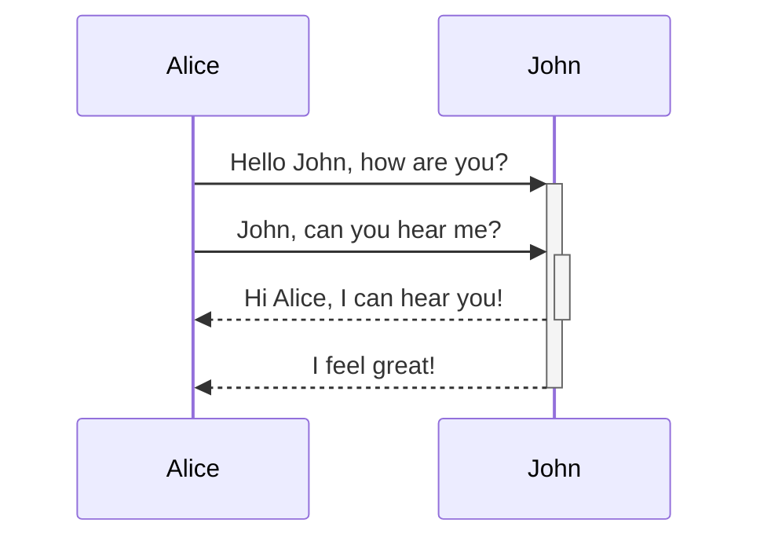

# heading 

```js
new code
```



function CodeBlock(props) {
    var className = props.language && "language-".concat(props.language);
    var code = createElement('code', className ? {
      className: className
    } : null, props.value);
  
    console.log(props.language, props.value);
    if(props.language === 'mermaid'){
  
      (async()=>{
        const svg = await new Promise( (resolve) => {
          mermaidAPI.render(props.language, props.value, (html) => resolve(html));
        });
        console.log(svg);
       })();
       return React.createElement('div', {}, props.value);
    }
  
    return createElement('pre', getCoreProps(props), code);
  }
  

  "@testing-library/jest-dom": "^5.16.1",
"@testing-library/react": "^12.1.2",
"@testing-library/user-event": "^7.2.1",
"better-docs": "^1.2.2",
"jsdocs": "^0.0.1",
"react-styleguidist": "^7.3.11",
"source-map-explorer": "^2.5.0"
